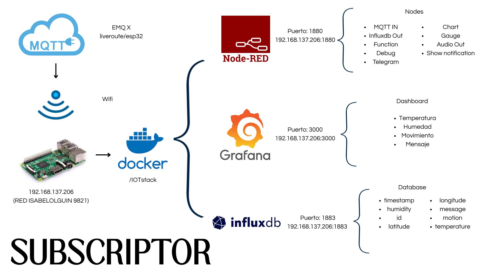

#  Live Route – Sistema IoT para Monitoreo de Entregas a Domicilio

##  Descripción del Proyecto

**Live Route** es una solución IoT diseñada para monitorear en tiempo real vehículos de entrega, enfocada en negocios locales de comunidades como Mixquiahuala, Hidalgo.  
El sistema recopila variables como **temperatura**, **humedad**, **vibraciones**, **coordenadas GPS** y alertas de emergencia a través de sensores distribuidos en una motocicleta de reparto.  
Los datos se transmiten mediante comunicación **LoRa** y **GPRS/MQTT** a un broker local en una **Raspberry Pi**, donde se almacenan y visualizan con herramientas como **Node-RED**, **InfluxDB** y **Grafana**.

El objetivo principal es proporcionar **trazabilidad**, **seguridad**, **eficiencia** y **transparencia** durante todo el proceso de entrega.

---

##  Tecnologías Utilizadas

### Hardware
- Heltec WiFi LoRa 32 v2
- Módulo GSM/GPRS LILYGO SIM7600G-H
- Sensor DHT11 (temperatura y humedad)
- Sensor SW-420 (vibraciones)
- Módulo GPS NEO-6M
- Pulsador (Botón de emergencia)
- Buzzer
- Regulador XL4015 Step-Down

### Software
- Lenguajes: C++ (Arduino), JavaScript, Python (Node-RED)
- Protocolos: ESP-NOW, LoRa, MQTT, GPRS
- Backend local: Raspberry Pi (con EMQX Broker)
- Dashboard: Node-RED + InfluxDB + Grafana
- Notificaciones: Bot de Telegram (envío de alertas)
- Visualización remota en tiempo real

---

##  Diagrama de Topología Lógica

Este diagrama muestra la comunicación entre cada módulo del sistema, desde sensores hasta visualización de datos.

---
